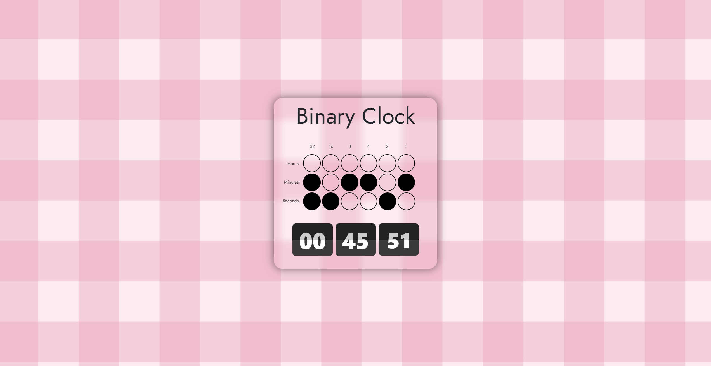

<h1 align="center">Binary Clock</h1>

  <b>Clocks displayed in binary format.</b>

## ✨ Features

- Binary clock created using html, css and vanilla javascript.
- Uses bootstrap
- Includes flip clock by [Shaw](https://codepen.io/shshaw)

## 📋 To-do List

- Make responsive

## 📜 Credits

Everything is coded by Alex lo Storto unless otherwise noted

Licensed under the MIT License.
